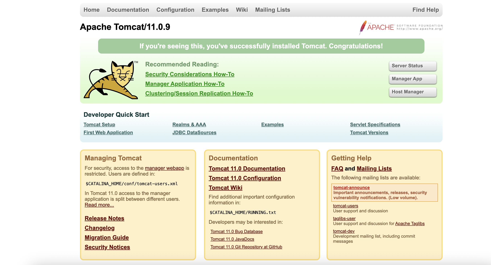
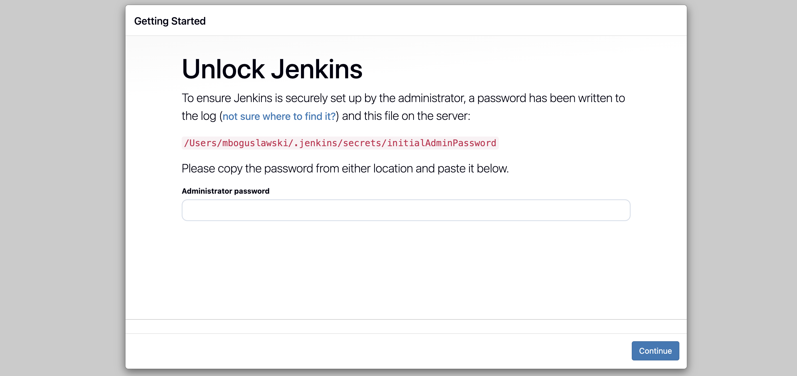
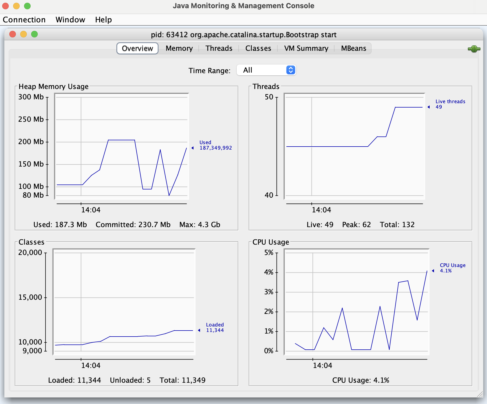
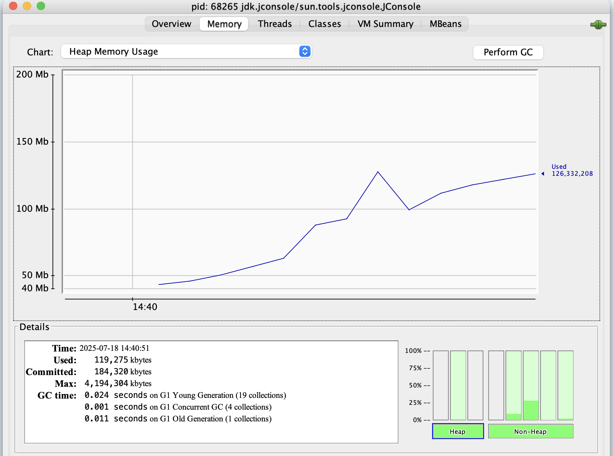
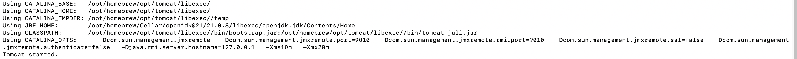
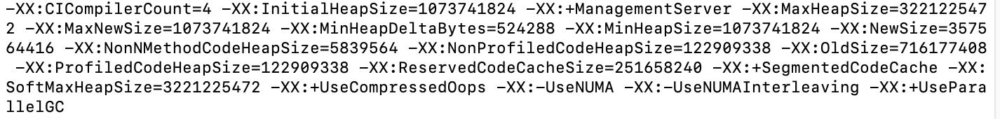
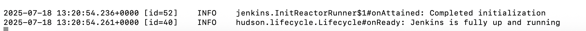

# Java Practical Tasks

Download/install Tomcat server.  
Verify that it works by visiting the root page.

<p align="center">  </p>

---

### What ports are used by the java process?

- System uses 2 main ports for Tomcat: 8080 (Tomcat port), 8005 (shutdown port)  
- But Java also uses other ports.

---

### Tasks

- Remove all default applications (including manager), restart Tomcat.  
- Download Jenkins WAR and deploy into Tomcat.  

Access Jenkins at:  
[http://localhost:8080/jenkins](http://localhost:8080/jenkins)

<p align="center">  </p>

---
Verify that application works (visit application URL).  
Enable JMX in Tomcat.

<p align="center">  </p>

---

### What ports are used by the java process?

Some more ports appeared:

| Port          | Interface   | Status        | Purpose                                                            |
| ------------- | ----------- | ------------- | ------------------------------------------------------------------ |
| `53271`       | `*`         | `LISTEN`      | Likely an **RMI registry** port (used internally by JMX)           |
| `9010`        | `*`         | `LISTEN`      | **JMX port** (explicitly enabled in `setenv.sh`)                   |
| `53272`       | `*`         | `LISTEN`      | Likely a **JMX RMI port** (dynamically assigned)                   |
| `8080`        | `*`         | `LISTEN`      | Alias `http-alt` — **Tomcat’s HTTP port 8080**                     |
| `8005`        | `localhost` | `LISTEN`      | **Tomcat shutdown port 8005** — listens for `SHUTDOWN` string     |
| `53357–53359` | `localhost` | `ESTABLISHED` | Internal communication — probably from JMX client like `jconsole`  |

---

### Content of `setenv.sh` file:

```sh
export CATALINA_OPTS="$CATALINA_OPTS \
  -Dcom.sun.management.jmxremote \
  -Dcom.sun.management.jmxremote.port=9010 \
  -Dcom.sun.management.jmxremote.ssl=false \
  -Dcom.sun.management.jmxremote.authenticate=false \
  -Djava.rmi.server.hostname=127.0.0.1"
````

---

### Change `CATALINA_OPTS` to use same port for RMI as for JMX

New content of the file `setenv.sh`:

```sh
export CATALINA_OPTS="$CATALINA_OPTS \
  -Dcom.sun.management.jmxremote \
  -Dcom.sun.management.jmxremote.port=9010 \
  -Dcom.sun.management.jmxremote.rmi.port=9010 \
  -Dcom.sun.management.jmxremote.ssl=false \
  -Dcom.sun.management.jmxremote.authenticate=false \
  -Djava.rmi.server.hostname=127.0.0.1"
```

---

### What ports are used by the java process now?

Still see random ports 53271 and 53272. Interesting why ... 

| **Port**            | **Common Name**           |
| ------------------- | ------------------------- |
| `53271`             | Dynamic RMI port (random) |
| `9010`              | JMX fixed port            |
| `53272`             | Dynamic RMI port (random) |
| `8080` (`http-alt`) | HTTP port                 |
| `8005`              | Shutdown port             |

---

### Rerun Tomcat with min heap size 10M and max heap size 20M.

Changed `setenv.sh` file:

```sh
export CATALINA_OPTS="$CATALINA_OPTS \
  -Dcom.sun.management.jmxremote \
  -Dcom.sun.management.jmxremote.port=9010 \
  -Dcom.sun.management.jmxremote.rmi.port=9010 \
  -Dcom.sun.management.jmxremote.ssl=false \
  -Dcom.sun.management.jmxremote.authenticate=false \
  -Djava.rmi.server.hostname=127.0.0.1 \
  -Xms10m \
  -Xmx20m"
```

---

### What type of error will you get?

Interesting, I didn't get any error. Let's take a look at jconsole:

<p align="center">  </p>

I see that threshold for heap memory doesn't work. It should be limited to the scope 10M-20M.

---

Successfully started `tomcat` (label: homebrew.mxcl.tomcat)

<p align="center">  </p>

---

### Increase min heap size to 1G and max heap size to 3G, enable parallel garbage collector.

`setenv.sh` content:

```sh
#!/bin/sh

export CATALINA_OPTS="$CATALINA_OPTS \
  -Xms1g \
  -Xmx3g \
  -XX:+UseParallelGC \
  -Dcom.sun.management.jmxremote \
  -Dcom.sun.management.jmxremote.port=9010 \
  -Dcom.sun.management.jmxremote.rmi.port=9010 \
  -Dcom.sun.management.jmxremote.ssl=false \
  -Dcom.sun.management.jmxremote.authenticate=false \
  -Djava.rmi.server.hostname=127.0.0.1"
```

---

Connect by JConsole to Tomcat and look around.

It seems that specified limits are applied correctly:

```bash
jcmd 71922 VM.flags | grep HeapSize
```

<p align="center">  </p>

---

### Stop Tomcat.

Launch Jenkins WAR as a standalone application, verify that it works.

Yes, it went well!

<p align="center">  </p>
